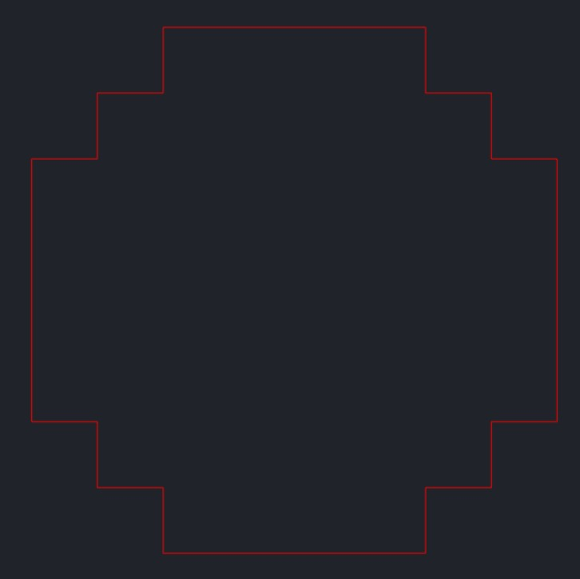

# Precision-Safe Rendering of Large-Coordinate CAD Drawings in Three.js

Rendering AutoCAD drawings in the browser using Three.js becomes challenging when geometries contain **extremely large coordinates** — often in the range of **10⁸ to 10⁹**.  

This README explains:

- Why large coordinates break rendering precision  
- How different engines (especially **Cesium**) solve this problem  
- Why applying transforms on existing Three.js geometry **does not** fix precision loss  
- The correct solution implemented in this project: **re-centering coordinates *before* geometry creation**

[🌐 Live Demo](https://mlightcad.github.io/large-coordinate-rendering/)

---

## 1. The Large-Coordinate Precision Problem

JavaScript (and WebGL) use **64‑bit floating point numbers** for CPU-side calculations, but GPU shaders typically use **32‑bit floats**, A 32-bit float has:

- 23-bit mantissa
- ~7.2 decimal digits of precision

For 𝑥 = 4 × 10<sup>8</sup> ≈ 2<sup>28.6</sup>, the exponent 𝑒 ≈ 29 and:

- ULP ≈ 2<sup>29−23</sup> = 2<sup>6</sup> = 64

**Meaning**: At around 4×10⁸, the smallest increment in Float32 is 64. You cannot represent any number between:

- 400,000,000
- 400,000,064
- 400,000,128
- ...

Everything snaps to multiples of 64.

Suppose you are trying to generate a circle with radius 1000 and 128 segments:

```ts
const centerX = 4 * 1e8;   // 400,000,000
const centerY = 4 * 1e8;
```

A point on the circle is computed as follows.

```
x = 400,000,000 + cos(theta) * 1000
y = 400,000,000 + sin(theta) * 1000
```

The coordinates are as follows.

```
[
    {
        "x": 4000001000,
        "y": 4000000000,
    },
    {
        "x": 4000000998.7954564,
        "y": 4000000049.067674,
    },
    {
        "x": 4000000995.1847267,
        "y": 4000000098.0171404,
    },
    {
        "x": 4000000989.17651,
        "y": 4000000146.7304745,
    },
    {
        "x": 4000000980.78528,
        "y": 4000000195.090322,
    },
    {
        "x": 4000000970.0312533,
        "y": 4000000242.98018,
    }
    ......
]
```

After storing them in **BufferGeometry**, the coordinates become values as follows.

```
[
    {
        "x": 4000001024,
        "y": 4000000000,
    },
    {
        "x": 4000001024,
        "y": 4000000000,
    },
    {
        "x": 4000001024,
        "y": 4000000000,
    },
    {
        "x": 4000001024,
        "y": 4000000256,
    },
    {
        "x": 4000001024,
        "y": 4000000256,
    },
    {
        "x": 4000001024,
        "y": 4000000256,
    }
    ......
]
```

Even if your math uses **128 segments**, the rendered geometry appears as if it has **only 20 segments** because all points collapse onto a coarse approximation.



---

## 2. The Real Problem: Precision Is Lost When Uploading Vertices to the GPU

A natural idea for handling large CAD coordinates is:

```
Generate geometry using the original CAD coordinates, then apply a transform (e.g., translation) to move everything closer to the origin for rendering.
```

At first glance this seems like a reasonable approach — it attempts to accomplish the same goal as precision-safe rendering systems (like Cesium’s origin-shift technique): keep all vertex data close to (0,0,0) so GPU Float32 precision is sufficient. However, this approach fails in Three.js because precision is already destroyed before you apply the transform.

```
function createCircleLine(
  centerX: number,
  centerY: number,
  radius: number,
  segments: number = 128,
  color: number = 0xff0000
): THREE.LineLoop {
  const points: THREE.Vector3[] = [];

  for (let i = 0; i < segments; i++) {
    const theta = (i / segments) * Math.PI * 2;
    points.push(
      new THREE.Vector3(centerX + Math.cos(theta) * radius, centerY + Math.sin(theta) * radius, 0)
    );
  }

  // Precision is already destroyed in this line
  const geometry = new THREE.BufferGeometry().setFromPoints(points);
  const material = new THREE.LineBasicMaterial({ color });

  return new THREE.LineLoop(geometry, material);
}

const circle = createCircleLine(10e8 * 4 , 10e8 * 4, 1000);
const translationMatrix = new THREE.Matrix4().makeTranslation(-origin.x, -origin.y, 0);

// This line doesn't work because precision was already destroyed
object.applyMatrix4(translationMatrix);
```

### Stages to Pass Vertices Data to GPU

Three.js geometry creation involves the following stages:

#### Stage 1 — CPU-side math (safe precision)

- THREE.Vector3 uses JavaScript number (IEEE 754 double).
- Even coordinates around 4 × 10⁸ still have enough precision here.

At this point, the geometry is still accurate.

#### Stage 2 — Upload to GPU buffers (precision collapse)

When you create a BufferGeometry, Three.js copies your vertices into a **Float32Array**. Float32 has only ~7 decimal digits of precision, so large coordinates snap to coarse increments — often 64 units or more. This is the moment precision is irreversibly lost.

#### Stage 3 — Applying transforms (too late)

If you call:

```ts
geometry.applyMatrix4(translationMatrix);
```

you are transforming vertex data that has already been rounded by Float32. Applying a perfect transform to imprecise data simply produces imprecise results.

### Key Insight

Precision-safe rendering only works if the input to BufferGeometry is already small and safe. If you send large coordinates into a Float32Array, no transform afterward can restore the lost bits.

This is why the correct solution is to:

- Shift or re-center geometry before creating any BufferGeometry,
- Ensuring that the Float32 data sent to the GPU already fits within precision limits.


## 3. How Engines Like Cesium Solve This Challenge

Large-world engines like **CesiumJS**, **Unreal Engine (World Origin Rebasing)**, and **Google Earth** have the same problem as Three.js: the GPU uses **Float32**, which cannot handle real-world coordinates (e.g., Earth-centered coordinates ~6,371,000 meters).

But unlike Three.js, these engines implement **robust, multi-layered precision-preservation techniques**. Cesium combines three key strategies:

### 3.1 Camera-Relative Rendering (Origin-Shifting)

The core idea: **The GPU never sees large coordinates.** Everything is expressed *relative to the camera*, so values remain small.

#### Example

Suppose an object's world coordinate is:

    world = (4.0e8, 4.0e8, 0)

And the camera position is:

    camera = (3.99999995e8, 4.00000005e8, 0)

Cesium computes a **camera-relative position**:

    renderPos = world - camera
              = (5000, -5000, 0)

The GPU receives:

    (5000, -5000, 0)

#### How Cesium does it every frame

``` js
var relative = Cartesian3.subtract(modelMatrixTranslation, cameraPosition, scratchRelative);
```

Cesium sends `relative` to the shader so all vertices remain small.

### 3.2 GPU-Ready Double-Precision ("High/Low") Encoding

Cesium also emulates **float64** using a pair of float32 values.

    vec3 high; // high 32 bits
    vec3 low;  // low 32 bits

#### CPU-side split

``` js
function encodeFloat64(value, highLow) {
    var high = Math.fround(value);
    var low = value - high;
    highLow.high = high;
    highLow.low = low;
}
```

Example for `x = 400000000.1234567`:

    high = 400000000.0
    low  = 0.12345671653747559

#### GPU-side recombination

``` glsl
vec3 restoreFloat64(vec3 high, vec3 low) {
    return high + low;
}
```

This restores near 53‑bit double precision on a Float32 GPU.

### 3.3 High-Precision Model/View Matrices

Cesium even splits matrices into high/low components.

CPU:

``` js
Matrix4.multiply(cameraInverseHigh, modelMatrixHigh, modelViewHigh);
Matrix4.multiply(cameraInverseLow,  modelMatrixLow,  modelViewLow);
```

GPU:

``` glsl
vec4 highMV = u_modelViewHigh * vec4(positionHigh, 1.0);
vec4 lowMV  = u_modelViewLow  * vec4(positionLow,  1.0);
vec4 finalPos = highMV + lowMV;
```

This avoids cumulative Float32 errors in transforms.

### 3.4 Combined Example

World position:

    (432123456.123, 523456789.987, 12.5)

Camera:

    (432123000, 523456500, 10)

Camera-relative:

    (456.123, 289.987, 2.5)

Splitting:

    high = (456.125, 289.984, 2.5)
    low  = (-0.002, 0.003, 0.0)

Recombined in shader:

    (456.123, 289.987, 2.5)

Full precision recovered.

### 3.5 Why Three.js Does Not Do This Automatically

Three.js:

-   stores vertices in Float32Array
-   does not split high/low precision
-   applies transforms after precision is already lost
-   uses Float32 for all model/world transforms

Thus Three.js requires **manual** precision handling.

### 3.6 Summary

| Technique | Purpose | Precision |
|-----------|---------|-----------|
| Camera-relative rendering | Keep GPU coords small | Prevents large magnitudes |
| High/Low encoded vertices | Emulate float64 |High precision |
| Split model/view matrices | Avoid FP32 error accumulation | Accurate transforms |
| Dynamic origin shifting | Maintain local precision | Always near origin |

---

## 4. The Solution Used in This Project

We adopt a simpler but effective version of the “origin-shift” idea: Recompute geometry using **re-centered coordinates** BEFORE creating any Three.js geometry.

1. Compute the bounding box of all CAD data.
2. Compute the center point of that box.
3. Treat that point as **the new origin (0,0)**.
4. Recompute every geometry (circle, polyline, etc.) using:

   ```
   worldCoord - basePoint
   ```

5. Store `basePoint` and add it back for coordinate conversions (mouse interactions, snapping, measurements).

This ensures:

- All rendering uses **small coordinates**  
- No precision loss during geometry generation  
- Perfectly smooth circles even with extremely large original coordinates

---

## 5. Conclusion

Large-coordinate data from CAD or GIS systems cannot be rendered correctly in Three.js without special handling, because GPU precision is limited. 

The correct approach is: **Always compute geometry using precision-safe, re-centered coordinates.**

This project implements that approach by:

- Computing a `basePoint` (dynamic origin)
- Rebuilding geometry using offset coordinates
- Returning to original coordinates for interaction APIs

This ensures pixel-perfect rendering even when working with CAD drawings containing coordinates in the range of 1e8–1e9 or higher.

